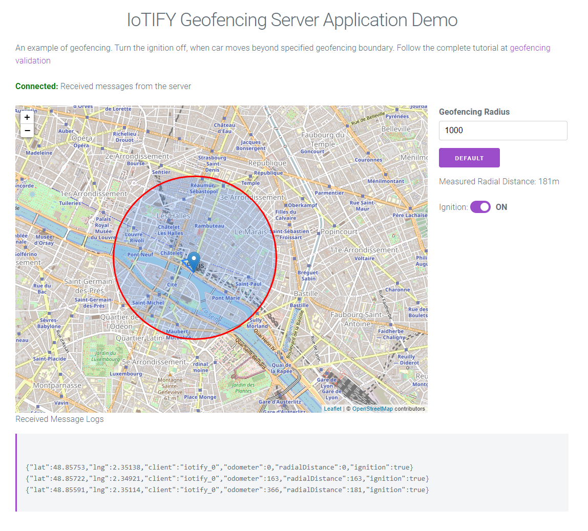

## IoTIFY geofencing sample server application example.

This application is a simple server side application, which monitors the GPS location of car. The application is intentionally minimalistic and is only developed to augment the capabilities of IoTIFY device simulator.

Follow the  [tutorial](https://docs.iotify.io/iot-testing/iot-functional-testing/geofencing-validation) to run and end to end example of geofencing application along with this application. 


### How to run

You could run this as a codesandbox project directly at this [URL](https://codesandbox.io/s/github/iotify/geofencing-server-demo). Alternatively, run this as a standalone node.js application. Clone the git repository and install the npm dependencies and then run app.js 

```
npm i
PORT=8000 node app.js

```

Replace PORT to any open port on your server. The IP address/server URL must be publicly reachable. 
